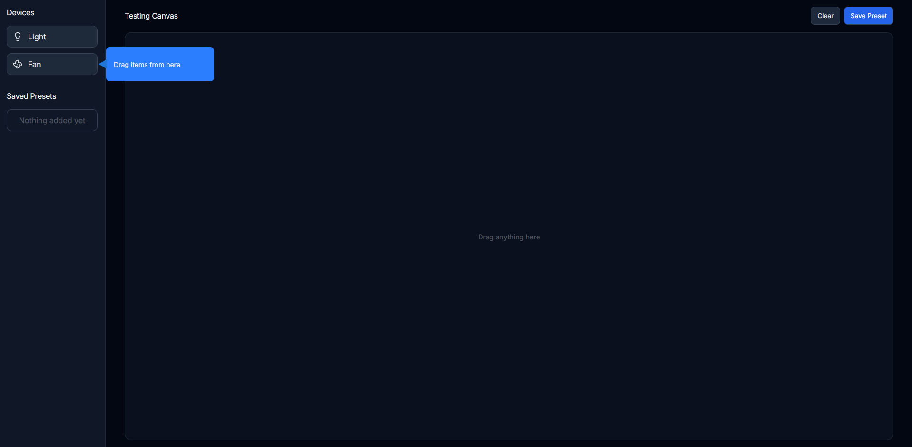
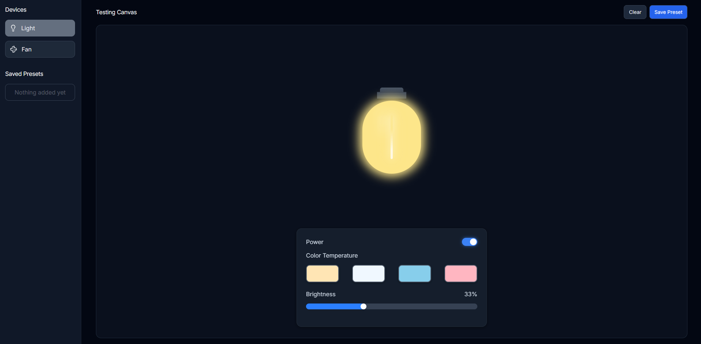
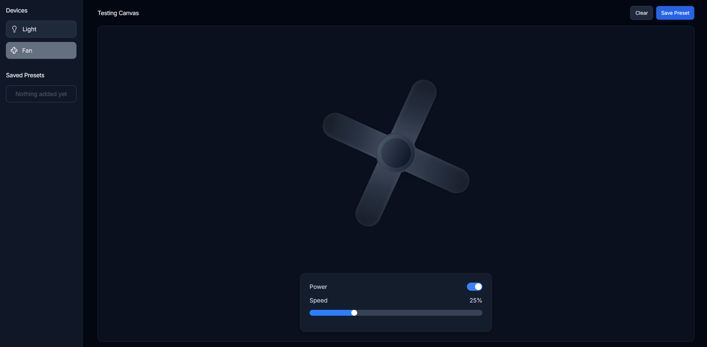

# Device Sandbox Simulator

A **React + PHP full-stack project** built for the **Full-Stack Developer (Mid-Level)** assignment.  
It demonstrates interactive device control with backend persistence, validations, and a polished UI.

---

## 🖼️ Project Preview

### 🧩 Canvas & Device Controls



### 💡 Light Controls



### 🌀 Fan Controls



---

## 📁 Folder Structure

```
device-sandbox/
│
├── backend/
│ ├── api.php # PHP backend for CRUD operations
│ └── data.json # JSON data storage
│
├── frontend/
│ ├── public/
│ ├── src/
│ │ ├── assets/ #  preview screenshots
│ │ ├── components/ # All React UI components
│ │ │ ├── Canvas/
│ │ │ ├── ConfirmModal/
│ │ │ ├── Fan/
│ │ │ ├── Light/
│ │ │ ├── PresetModal/
│ │ │ ├── Sidebar/
│ │ │ └── Toast/
│ │ ├── utils/ # API & storage utilities
│ │ ├── types.ts # Global TypeScript interfaces
│ │ ├── App.scss
│ │ ├── App.tsx # Root component
│ │ └── main.scss
│ │ └── main.tsx # Entry file
│ ├── package.json
│ └── vite.config.ts
├── .gitignore
└── README.md

```

## 🚀 Features

- **Drag & Drop Devices** — Add Light or Fan on canvas.
- **Live Device Control**
  - Light → brightness & color control
  - Fan → speed control
- **Save Presets** — Store device configurations in backend (PHP JSON).
- **Load / Delete Presets** — Instantly restore or remove setups.
- **Validation** — Only one device allowed at a time; replaces previous device.
- **Confirmation & Toast Alerts** — For better user feedback.
- **Modern UI** — Built with React, SCSS & clean layout.

---

## 🧠 Tech Stack

| Layer             | Technology                      |
| ----------------- | ------------------------------- |
| **Frontend**      | React (Vite + TypeScript), SCSS |
| **Backend**       | PHP (file-based JSON storage)   |
| **Storage**       | `backend/data.json`             |
| **Communication** | Fetch API (REST endpoints)      |

---

## ⚙️ Installation & Run

### 1️ Clone the Repository

```bash
git clone https://github.com/nrshagor/device-sandbox.git
```

### 2️ Frontend Setup (React + Vite)

```bash
cd frontend
npm install
npm run dev
```

Runs at: http://localhost:5173/

### 3️ Backend Setup (PHP)

If using Laragon / XAMPP / WAMP:

Keep the backend/ folder inside your web root (e.g. C:\laragon\www\device-sandbox\backend)

- Start Apache Server

- Test API in browser: http://localhost/device-sandbox/backend/api.php?action=get

### API Endpoints

| Method   | Endpoint                 | Description             |
| :------- | :----------------------- | :---------------------- |
| `GET`    | `/api.php?action=get`    | Fetch all saved presets |
| `POST`   | `/api.php?action=save`   | Save a new preset       |
| `DELETE` | `/api.php?action=delete` | Delete a preset by name |

Presets are stored in:

```bash
backend/data.json
```

### 🧩 Usage Guide

- Drag a Light or Fan from the sidebar onto the canvas

- Adjust its settings (speed, brightness, or color)

- Click Save Preset to store setup to backend

- Load saved presets anytime

- Delete a preset with confirmation modal

### 👨‍💻 Developer Info

Name: Noore Rabbi Shagor

Role: Senior Full-Stack Web Developer

Portfolio: https://nrshagor.com

Email: noorerabbishagor@gmail.com

Tech Expertise: ReactJS, NextJS, NestJS, Laravel, PostgreSQL, MySQL, TypeScript
